# Module 2 Group Assignment

CSCI 5117, Spring 2022, [assignment description](https://canvas.umn.edu/courses/355584/pages/project-2)

## App Info:

* Team Name: Upper Five
* App Name: Style Snips
* App Link: https://style-snips.netlify.app/

### Students

*Anwaar Hadi, hadi0013
*Jason Woitalla, woita006
*William Mleziva, mlezi006
*Aditi Patil, patil112
*Ash Kuroki, kurok011

## Key Features

**Describe the most challenging features you implemented
(one sentence per bullet, maximum 4 bullets):**

1. We created a polygon cropping masks for each wardrobe category the images uploaded or captured 
2. We implemented the ability to save outfits based on the all the image carousels' current image
3. We used a cloud storage provider [BackBlaze](https://www.backblaze.com/) with codehooks to store and retrieve the images 

Which (if any) device integration(s) does your app support?

* Our app supports the webcam intergration on desktop (or file upload) and the front and back camera integration on a mobile device. On a mobile device we also support fliping the camera to allow users to easily take photos 

Which (if any) progressive web app feature(s) does your app support?

* Our app's layout is reponsive and folllows a mobile first design. We have a menu bar as the main navigation in the desktop view and a bottom navigation bar for the mobile view.

## Mockup images

**[Add images/photos that show your mockup](https://stackoverflow.com/questions/10189356/how-to-add-screenshot-to-readmes-in-github-repository) along with a very brief caption:**

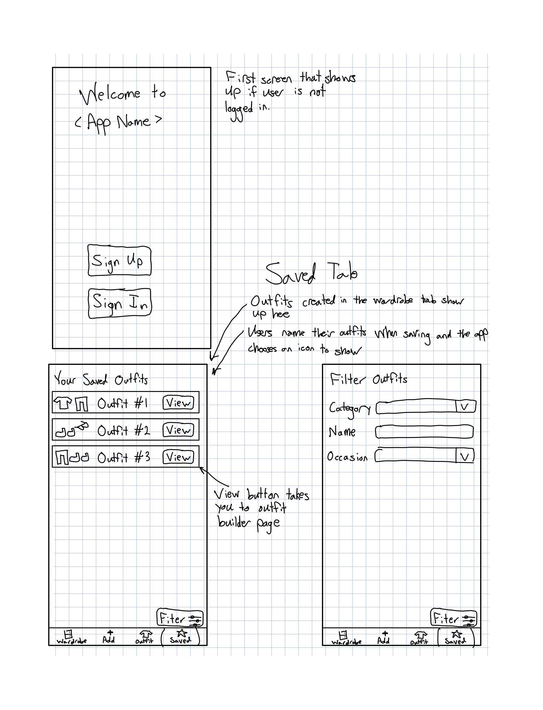
Here we have a standard login screen. Along with it the last tab in our nav bar. THe saved tab is where users can view/edit their saved outfits. There will be nice sorting features for users to easily find their saved outfits so they don't loose track of them.
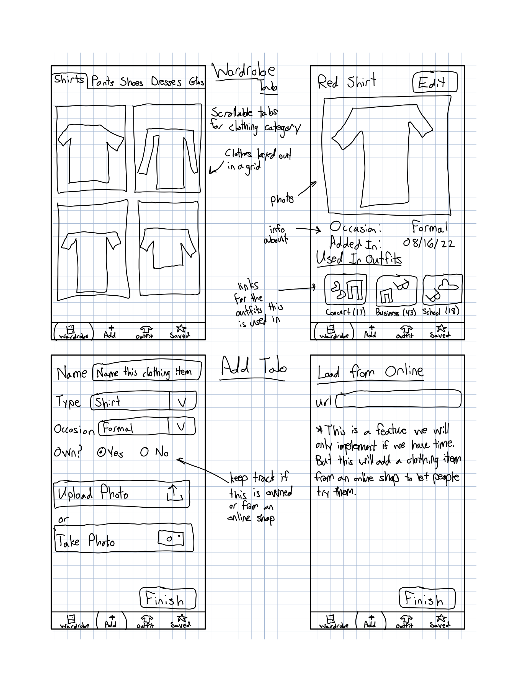
Here we have the wardrobe tab which is the default tab when the app loads. Cloths the user has logged appear here in a grid and they can click on a peice of clothing to get more information about it. They can edit/delete cloths in that page. To add cloths they click the add tab in the bottom nav and fill out the form.
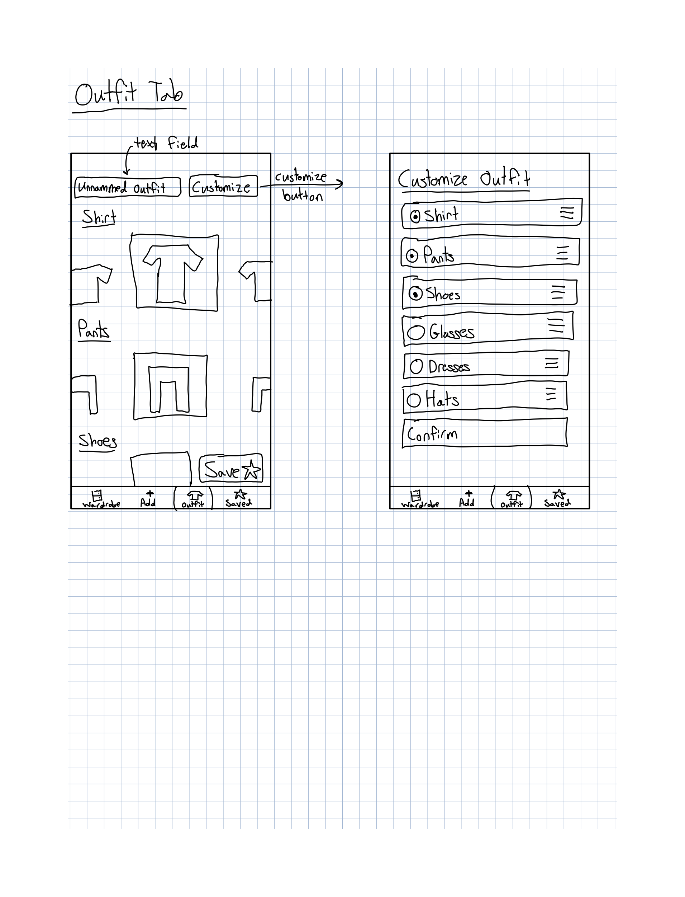
The final tab the user can go to is the outfit builder. Here users can customize what components are in their outfit and what order they appear in. Then they can swip left or right to pick what peice of outfit they want. Then they can save the outfit for later use.

## Testing Notes

**Is there anything special we need to know in order to effectively test your app? (optional):**

* N/A 

## Screenshots of Site (complete)

**[Add a screenshot of each key page](https://stackoverflow.com/questions/10189356/how-to-add-screenshot-to-readmes-in-github-repository)
along with a very brief caption:**

The app requires a user to log in so that is the first thing that the user is prompted to do once. Once logged in the user is taken to the `/wardrobe` page
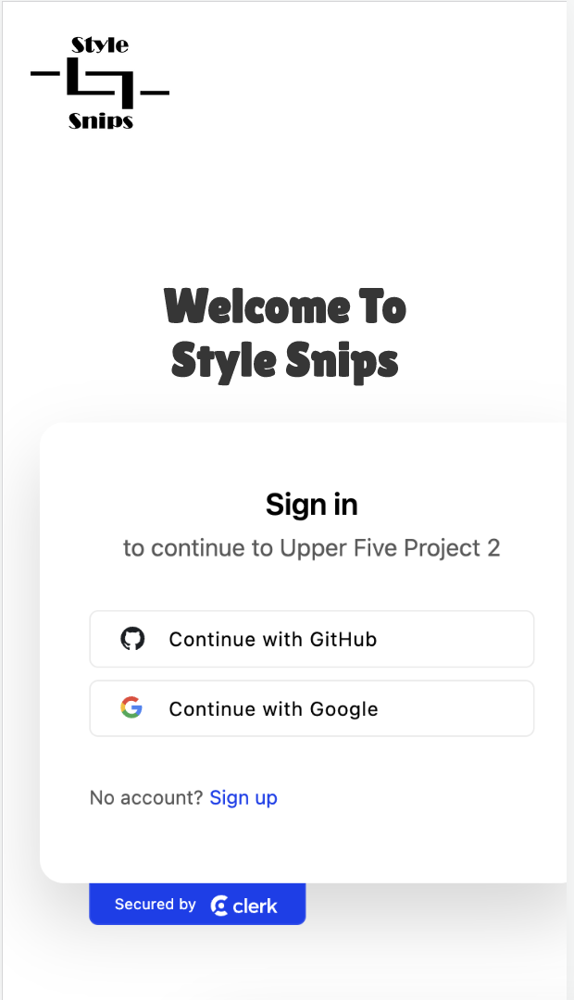

### Wardrobe Page
Clothes the user has logged appear here in a grid and they can click on a peice of clothing to get more information about it. They can edit/delete cloths in that page. 

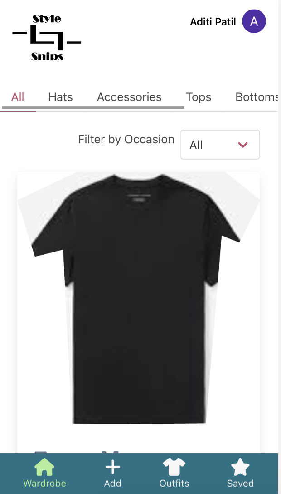

### Add Item
To add cloths they click the add tab in the bottom nav and fill out the form. They can either upload a file/image or they can use the camera/webcam to capture the photo.

This is the standard image capture page. As you can see below we have a camera flip option (works on mobile) and a capture image button.
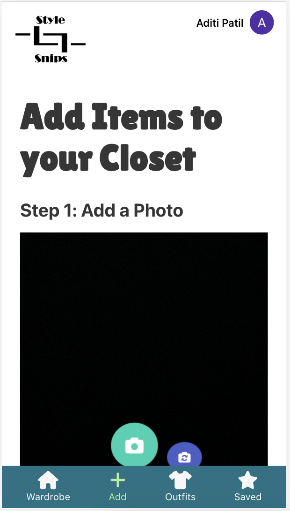 

Once the user uploads or captures the image they are brougt to a cropping page, they can select the outline which matches their outfit type (long sleve, short sleve, etc). User can drag the dots and the mask to crop the image to their liking.
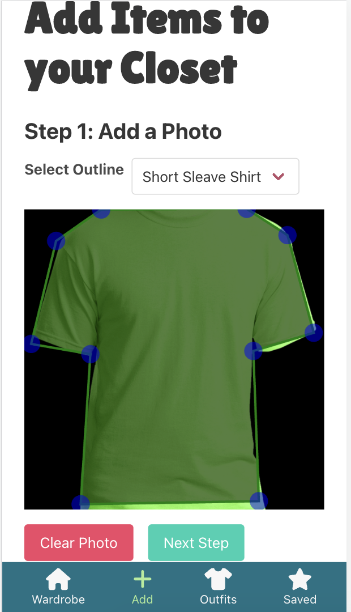 

Next, once they approve of the cropping they are taken to the add form which shows them the preview of the image to be saved. They will then fill in the item information and save the item.
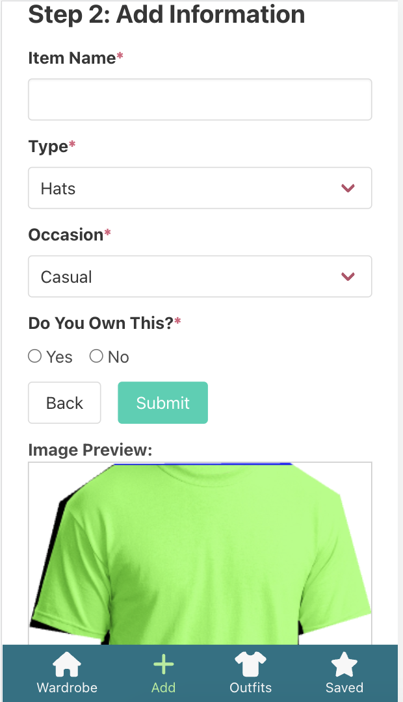

### Outfit Builder:
Here users can customize what components are in their outfit using the `Customize` button. Then they can swip left or right to pick what piece of outfit they want (item has to be in wardrobe). Then they can name and save the outfit for later use.

This shows one of the image carousels which you can swipe on. You can scroll down to see the other carousels and also save the outfit.
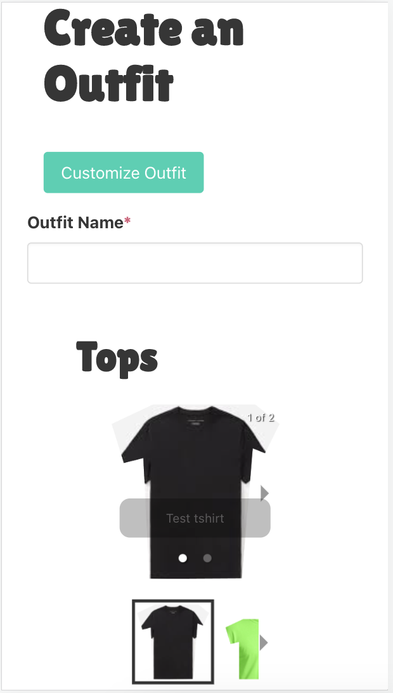

This is the customize menu which you can access by clicking on the `Customize` button in the previous image. You can add/remove different clothing components in the outfit.
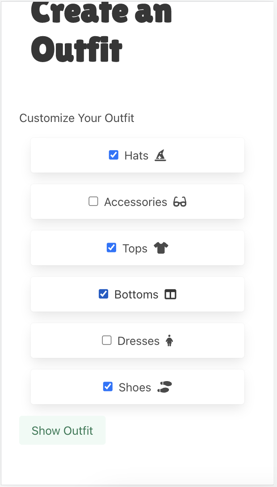

### Saved Outfits:
THe saved tab is where users can view their saved outfits by clicking on the outfit(they can also delete it ). Users to easily find their saved outfits so they don't loose track of them.
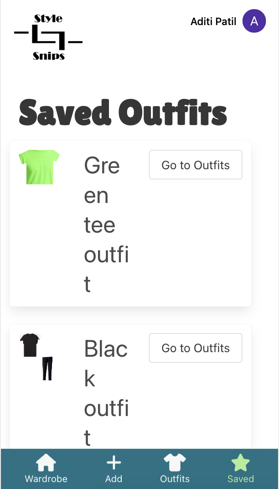 

The following is a preview of the outfit once you click on it. If you scroll down then there should be a delete button as well
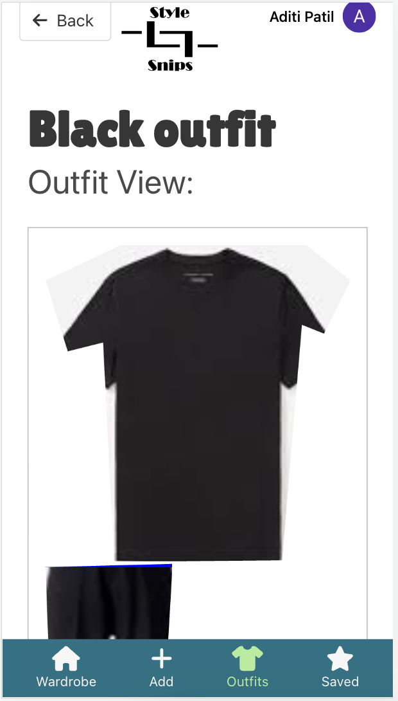 

## External Dependencies

**Document integrations with 3rd Party code or services here.
Please do not document required libraries (e.g., Vue, Vuefire, Firebase).**

* Library or service name: description of use
1. BackBlaze (cloud storage provider) - https://www.backblaze.com/
2. Clerk (3rd party Authentication provider) - https://clerk.com/

**If there's anything else you would like to disclose about how your project
relied on external code, expertise, or anything else, please disclose that
here:**

...
